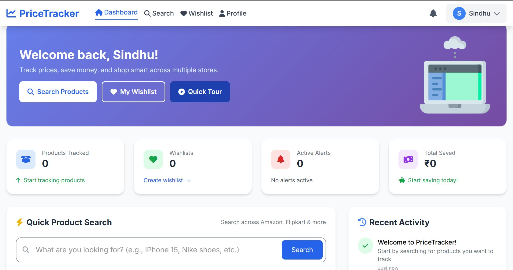
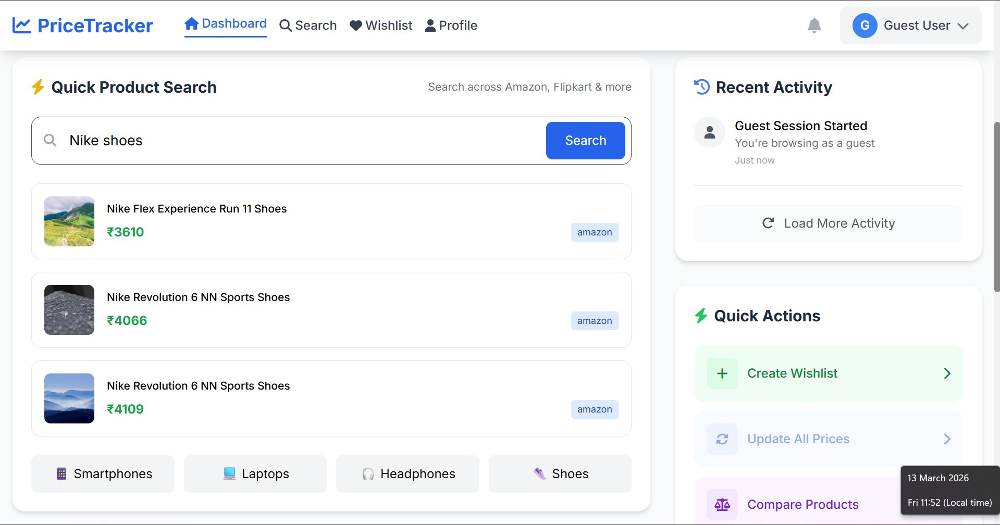
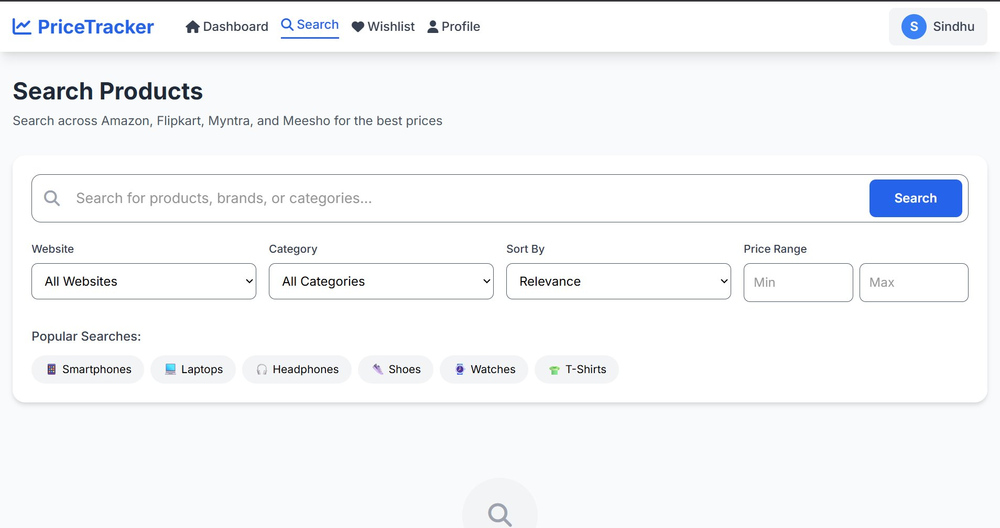
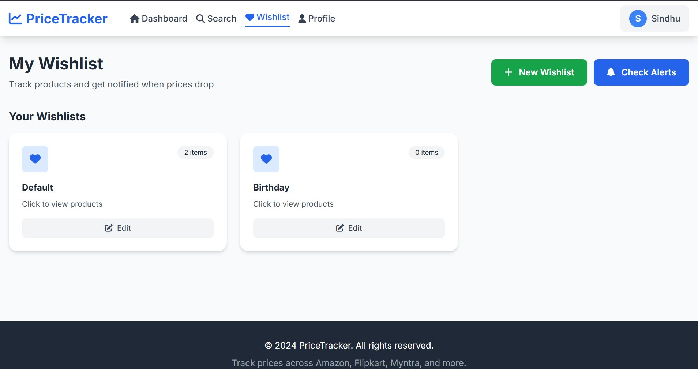
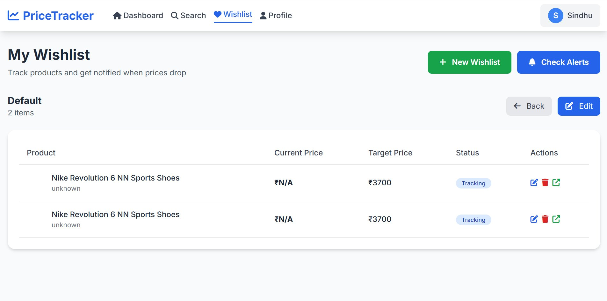

# 🛒 PriceTracker — Smart E-commerce Price Comparison

PriceTracker is a full-stack web application that lets you **search, compare, and track product prices** across Amazon and Flipkart. Set target prices, build wishlists, and get alerted when prices drop.

Built with **Flask (Python)** on the backend and **HTML + Vanilla JS** on the frontend, with a SQLite database — no complex infrastructure required.

---

## 📸 Screenshots

### Dashboard (Logged In)

*Personalised dashboard showing tracked products, wishlists, active alerts, and total savings.*

### Dashboard (Guest Mode)

*Guest users can search and browse products without creating an account.*

### Search Products

*Search across Amazon, Flipkart, Myntra, and Meesho with filters for website, category, sort order, and price range.*

### Wishlist Overview

*Create and manage multiple wishlists — "Default" has 2 items tracked, "Birthday" is ready for products.*

### Wishlist Items & Price Tracking

*Each tracked product shows current price, your target price, and live tracking status with edit and remove actions.*

> **Setup:** Create a `screenshots/` folder in the root of your project and place all 5 image files inside it for these to render on GitHub.

---

## ✨ Features

- 🔍 **Search Products** — compare prices across Amazon & Flipkart in real time
- 💖 **Wishlists** — create multiple wishlists to organise products you want to buy
- 🎯 **Target Price Alerts** — set a price goal and get notified when it's reached
- 📈 **Price History Tracking** — see how prices have changed over time
- 👤 **User Accounts** — secure JWT-based login and registration
- 👻 **Guest Mode** — browse and search without creating an account
- 📊 **Dashboard** — view your savings, active alerts, and tracked products at a glance

---

## 🗂️ Project Structure

```
Price_Comparision/
│
├── backend/                  # Python / Flask server
│   ├── app.py                # Main Flask app & all API routes
│   ├── auth.py               # Login, register, JWT auth routes
│   ├── scraper.py            # Amazon & Flipkart scraper + smart fallback
│   ├── models.py             # SQLAlchemy database models
│   ├── database.py           # DB initialisation
│   └── config.py             # App configuration
│
├── frontend/                 # HTML pages served by Flask
│   ├── dashboard.html        # Home / analytics dashboard
│   ├── product_search.html   # Search & compare products
│   ├── wishlist.html         # Wishlist management
│   ├── profile.html          # User profile
│   ├── auth.html             # Login & registration
│   ├── main.css              # Core styles
│   └── responsive.css        # Mobile responsive styles
│
├── requirements.txt          # Python dependencies
├── run.py                    # App entry point
└── README.md                 # This file
```

---

## 🚀 Running Locally in VS Code — Step by Step

### Prerequisites

Make sure you have the following installed before you start:

| Tool | Minimum Version | Download |
|------|----------------|---------|
| Python | 3.8+ | https://www.python.org/downloads/ |
| pip | bundled with Python | — |
| VS Code | Any recent version | https://code.visualstudio.com/ |
| Git | Any | https://git-scm.com/ |

> **Tip:** During Python installation on Windows, tick **"Add Python to PATH"** — this saves a lot of trouble later.

---

### Step 1 — Clone the Repository

Open VS Code, press `Ctrl+`` ` to open the terminal, then run:

```bash
git clone <repository-url>
cd Price_Comparision
```

---

### Step 2 — Open in VS Code

```bash
code .
```

Or open VS Code manually → **File → Open Folder** → select the `Price_Comparision` folder.

**Recommended VS Code Extensions** (install from the Extensions panel `Ctrl+Shift+X`):

- **Python** (by Microsoft) — syntax highlighting, IntelliSense
- **Pylance** — type checking and auto-complete
- **REST Client** *(optional)* — test API endpoints directly in VS Code

---

### Step 3 — Create a Virtual Environment

In the VS Code terminal:

```bash
# Create virtual environment
python -m venv .venv
```

Then activate it:

```bash
# Windows (PowerShell)
.venv\Scripts\Activate

# Windows (Command Prompt)
.venv\Scripts\activate.bat

# Mac / Linux
source .venv/bin/activate
```

You should see `(.venv)` appear at the start of your terminal prompt — this confirms it's active.

> **VS Code tip:** Press `Ctrl+Shift+P` → type **"Python: Select Interpreter"** → choose the `.venv` option. VS Code will then use this environment automatically.

---

### Step 4 — Install Dependencies

```bash
pip install -r requirements.txt
```

This installs Flask, SQLAlchemy, JWT, BeautifulSoup, bcrypt, and all other required packages. It will take about 1–2 minutes.

If you see any errors, try:

```bash
pip install -r requirements.txt --upgrade
```

---

### Step 5 — Run the App

```bash
cd backend
python app.py
```

You should see output like:

```
🚀 PRICETRACKER - E-COMMERCE PRICE COMPARISON
📊 Dashboard: http://localhost:5000
✅ PriceScraper initialized successfully
 * Running on http://0.0.0.0:5000
```

---

### Step 6 — Open in Browser

Visit: **http://localhost:5000**

The app will automatically:
- Create the SQLite database (`pricetracker.db`) on first run
- Create a default admin account

---

## 🔐 Demo Credentials

| Role | Email | Password |
|------|-------|----------|
| Admin | admin@example.com | admin123 |
| Test User | test@example.com | password123 |

You can also register your own account from the login page.

---

## 🌐 Pages & Routes

| Page | URL |
|------|-----|
| Dashboard | http://localhost:5000 |
| Search Products | http://localhost:5000/product_search.html |
| Wishlist | http://localhost:5000/wishlist.html |
| Profile | http://localhost:5000/profile.html |
| Login / Register | http://localhost:5000/auth.html |
| API Health Check | http://localhost:5000/api/health |

---

## ⚙️ API Endpoints

| Method | Endpoint | Description | Auth Required |
|--------|----------|-------------|---------------|
| POST | `/api/register` | Create new account | No |
| POST | `/api/login` | Login & get JWT token | No |
| POST | `/api/search` | Search products | No |
| GET | `/api/wishlists` | Get user's wishlists | Yes |
| POST | `/api/wishlists` | Create a wishlist | Yes |
| PUT | `/api/wishlists/<id>` | Rename a wishlist | Yes |
| DELETE | `/api/wishlists/<id>` | Delete a wishlist | Yes |
| GET | `/api/wishlists/<id>/items` | Get items in a wishlist | Yes |
| PUT | `/api/wishlists/items/<id>` | Update target price | Yes |
| DELETE | `/api/wishlists/items/<id>` | Remove item | Yes |
| POST | `/api/track-product` | Add product to wishlist | Yes |
| GET | `/api/price-alerts` | Get triggered price alerts | Yes |
| GET | `/api/dashboard/stats` | Get dashboard stats | Yes |

---

## 🛠️ Tech Stack

| Layer | Technology |
|-------|-----------|
| Backend | Python 3, Flask, Flask-JWT-Extended |
| Database | SQLite via Flask-SQLAlchemy |
| Auth | bcrypt password hashing + JWT tokens |
| Scraping | BeautifulSoup4, Requests, Cloudscraper |
| Frontend | HTML5, Tailwind CSS, Vanilla JavaScript |
| Dev Server | Flask built-in (Werkzeug) |

---

## ❓ Troubleshooting

**`python` not recognised in terminal**
> Close and reopen VS Code after installing Python. Make sure "Add Python to PATH" was ticked during install.

**`ModuleNotFoundError`**
> Your virtual environment may not be active. Run `.venv\Scripts\Activate` (Windows) or `source .venv/bin/activate` (Mac/Linux) and try again.

**Port 5000 already in use**
> Another app is using port 5000. Stop the other process or change the port in `app.py`: `app.run(port=5001)`, then visit `http://localhost:5001`.

**Search returns no results / slow**
> Amazon and Flipkart sometimes block scraping. The app automatically falls back to realistic demo data when this happens — this is expected behaviour.

**"Session expired" on login page**
> Open browser DevTools (`F12`) → Application → Local Storage → clear all entries → refresh the page and log in again.

---

## 👩‍💻 Developer

**Raga Sindhu** 

---

*Happy Price Tracking! 🎯*
